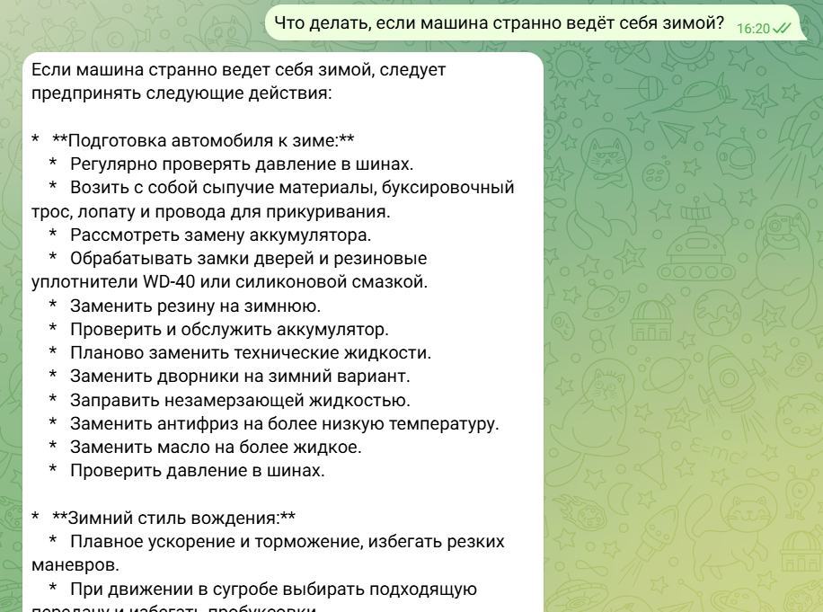
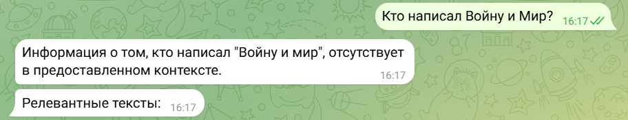

Telegram-бот для вопросов по Toyota Raum (1997-2003)

Этот бот отвечает на вопросы по техническому обслуживанию и эксплуатации автомобилей Toyota Raum на основе данных с автомобильного форума.

---

Описание

- Использует базу знаний из текстов автомобильного форума (фрагменты текстов с эмбеддингами).
- Принимает вопрос пользователя, ищет наиболее релевантные тексты по эмбеддингам.
- Генерирует ответ на основе найденного контекста с помощью модели Gemini.
- Реализован на aiogram с использованием Google Gemini API для эмбеддингов и генерации ответов.

---

Установка и запуск

1. Склонируйте репозиторий:

   git clone https://github.com/nivtilen/raum_mechanic_bot.git
   cd raum_mechanic_bot

2. Создайте и заполните файл .env:

   GEMINI_KEYS=gemini_key1,gemini_key2,gemini_key3
   API_TOKEN=your_telegram_bot_token

3. Установите зависимости:

   pip install -r requirements.txt

4. Скачайте базу знаний

   https://storage.yandexcloud.net/quizz-storage/embeddings.jsonl

4. Запустите бота:

   python bot.py

---

Использование

- /start — приветственное сообщение и пример вопросов.
- /help — описание тематики и примеры текстов из базы.
- Отправьте любой вопрос в чат — бот обработает и ответит, показав релевантные выдержки из базы.

---

Структура проекта

- bot.py — точка входа.
- handlers.py - функции обработки сообщений в Telegram
- emb_utils.py — функции для поиска релевантных текстов и генерации ответов с использованием эмбеддингов и модели Gemini.
- embeddings.jsonl — база знаний с фрагментами текстов и эмбеддингами (JSON Lines формат).
- .env.example — пример файла с переменными окружения.

---

Основные функции

- get_top_similar_texts — поиск наиболее близких текстов к запросу по эмбеддингам.
- build_rag_prompt — построение промпта с контекстом для генерации ответа.
- generate_answer — генерация текста ответа на основе контекста и запроса.

---

Примеры запросов

